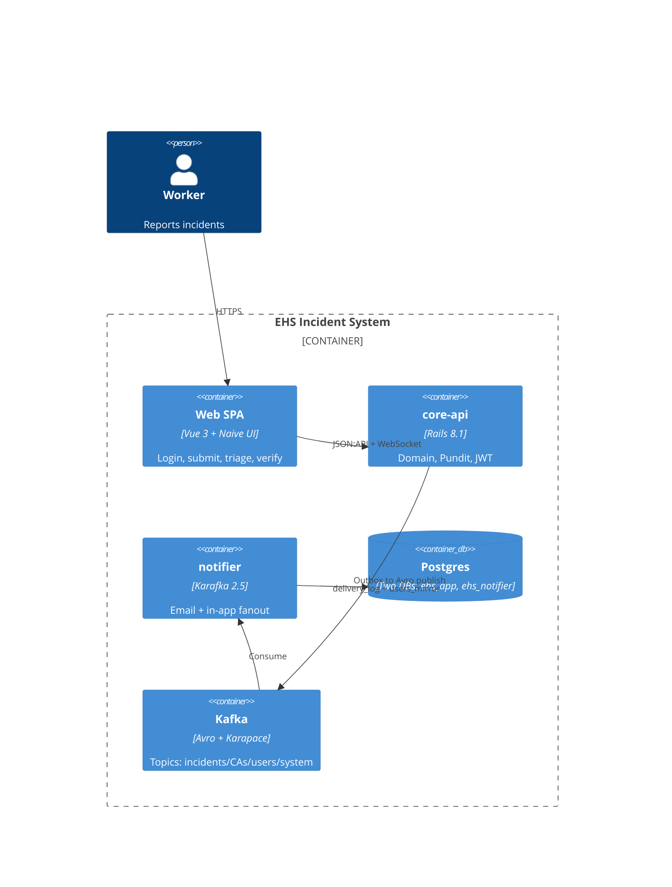

# EHS Incident System

> A portfolio-grade Environment, Health & Safety (EHS) incident management platform built with Ruby on Rails, Vue 3 + TypeScript, and an event-driven Kafka pipeline.

[](LICENSE)


[](https://github.com/ehs-labs/ehs-incident-system/actions/workflows/ci.yml)

<!--
  README assets: drop the captured files into docs/assets/ and uncomment.
  See docs/assets/CAPTURE.md for the recording / screenshotting recipe.

  
-->

## What this is

A multi-tenant EHS incident reporting and follow-up platform inspired by HSI Donesafe.

- **Workers** report safety incidents from their sites (photos, witnesses, narrative).
- **Investigators** triage, investigate, and assign corrective actions with due dates and evidence.
- **Admins** configure the workspace — users, sites, severity SLAs.

Notifications fan out across **email**, **Telegram**, and **in-app** (WebSocket) channels via a Kafka pipeline with a dedicated notification service.

## Architecture



See [`docs/architecture/02-c4-container.md`](docs/architecture/02-c4-container.md) for the full C4 Container view.

## Try it in 5 minutes

```bash
git clone https://github.com/ehs-labs/ehs-incident-system.git
cd ehs-incident-system
cp .env.example .env
./scripts/bootstrap.sh
```

This brings up the full stack via Docker Compose, runs migrations, and seeds demo data. After it finishes you can open:

| URL | What |
|---|---|
| http://localhost:5173 | The Vue app |
| http://localhost:1080 | MailCatcher — view confirmation/notification emails sent in dev |
| http://localhost:8080 | Kafka UI — inspect topics & messages |
| http://localhost:8081 | Karapace — Avro schema registry |
| http://localhost:3000/sidekiq | Sidekiq dashboard |
| http://localhost:9001 | MinIO console (`minioadmin` / `minioadmin`) |

Demo accounts (seeded by `scripts/seed-demo.sh`):

| Email | Password | Role |
|---|---|---|
| `admin@acme.demo` | `password` | Admin |
| `investigator@acme.demo` | `password` | Investigator |
| `worker@acme.demo` | `password` | Worker |

Or sign up fresh at `/signup` — signup is enabled by default (toggle with `SIGNUP_ENABLED`).

<!--
  Screenshots: drop dashboard.png and incident-detail.png into docs/assets/ then uncomment.

  | Dashboard | Incident detail |
  |---|---|
  |  |  |
-->

## Tech stack at a glance

| Layer | Stack |
|---|---|
| **Backend** | Ruby 4.0 · Rails 8.1 (API-only) · Devise + JWT · Pundit · AASM · PaperTrail · Sidekiq · rdkafka-ruby · pg_search |
| **Notification service** | Sinatra · Karafka · Falcon (async) · Sequel · telegram-bot-ruby |
| **Frontend** | Vue 3 · TypeScript · Vite · Pinia · Naive UI · Vue Router · Axios · openapi-typescript |
| **Persistence** | PostgreSQL 16 · Redis 7 · MinIO (S3) |
| **Event bus** | Apache Kafka (KRaft) · Karapace (open-source Schema Registry) · Avro |
| **Security** | TLS · SASL/SCRAM ACLs · encrypted PVCs · AES-256-GCM field-level encryption of PII |
| **Tests** | RSpec · factory_bot · rswag (OpenAPI) · Vitest · Playwright |
| **DevOps** | Docker · Docker Compose · Kubernetes · Kustomize · GitHub Actions |

See each stack section's "Why?" rationale in [`docs/architecture/02-c4-container.md`](docs/architecture/02-c4-container.md).

## Why this stack

**Event-sourcing via outbox + Kafka** — the outbox pattern decouples the notifier process from the synchronous request path so a slow email provider never blocks an incident submission. Events are durably written to Postgres inside the same transaction as the domain record, meaning a Kafka outage cannot drop notifications — the OutboxShipperJob acts as a transactional consistency bridge. This is the same pattern as Debezium/CDC change data capture, but home-grown to keep the deployment surface small and the logic auditable.

**Avro + Karapace** — schema-registry-enforced contracts catch breaking changes at publish time, not at consume time three days later in a different service. Avro's compact binary encoding and explicit nullable/default rules make event schema evolution safe across consumer versions without coordination windows. Karapace is the open-source, Kafka-native registry used here; it is wire-compatible with the Confluent Schema Registry API but carries no Confluent license obligation.

**Field-level AES-256-GCM encryption on `users.v1`** — PII (email, name, telegram_handle) is encrypted with a versioned keyring before being published to Kafka so that a broker compromise does not leak personal data in plaintext. The keyring supports multiple active key versions, allowing rotation without a full re-publish of historical events. The rotation drill is rehearsed end-to-end in `docs/flows/key-rotation.md`.

**Rails 8.1 + jsonapi-serializer** — Rails 8.1 in API-only mode is mature, ships `ActiveRecord::Encryption` out of the box, has first-class `bin/rails` tooling, and pairs naturally with PostgreSQL. `jsonapi-serializer` (descended from Netflix's `fast_jsonapi`) is roughly 30x faster than ActiveModelSerializers and renders correct JSON:API envelopes without the heavyweight `jsonapi-resources` framework pulling in routes and controllers.

**Vue 3 + Pinia + Naive UI** — Vue 3's composition API gives TypeScript-first ergonomics on par with React while keeping the learning curve gentle for contributors familiar with Rails view conventions. Pinia is the official Vue store with a tiny API surface and no Vuex boilerplate; stores map cleanly to bounded contexts. Naive UI is lean, fully typed, and renders fast — chosen over Element Plus or Vuetify for lower bundle weight and stronger design coherence at the cost of a smaller ecosystem.

**Kustomize over Helm** — for a single application that is not a redistributable chart, Kustomize's patches-over-base model is easier to audit than a Helm chart with layered values files and a templating language that diverges from standard YAML. Overlays for `local/` (kind/Docker Desktop) and `cloud/` (managed Kubernetes with cert-manager and External Secrets Operator) stay in plain YAML and diff cleanly in pull requests. ADR-0006 has the full reasoning.

## Documentation

- [**Architecture**](docs/architecture/) — C4 diagrams (L1–L3), deployment, ADRs
- [**Design**](docs/design/) — domain model, state machines, event contract, security
- [**Flows**](docs/flows/) — sequence diagrams for every critical path
- [**Operations**](docs/operations/) — local dev, K8s deploy, migrations, key rotation, end-to-end verification
- [**User guides**](docs/user-guide/) — Worker / Investigator / Admin

## Repository layout

```
ehs-incident-system/
├── core-api/             # Rails 8.1 API-only monolith
├── notifier/             # Sinatra notification service
├── frontend/             # Vue 3 + TypeScript + Vite
├── shared/envelope/      # ehs-envelope gem (AES-256-GCM)
├── schemas/events/v1/    # Avro schemas (.avsc)
├── docs/                 # Full design + ops + user-guide docs
├── k8s/                  # Kustomize base + local/cloud overlays
├── scripts/              # bootstrap, seed, K8s helpers
└── .github/              # CI/CD workflows, Dependabot, PR & issue templates
```

## Branch & release strategy

- `main` is protected. PRs only. Squash-merge.
- Branches: `feat/<short-name>`, `fix/<short-name>`, `chore/<short-name>`, `docs/<short-name>`.
- Conventional Commits in titles (`feat:`, `fix:`, `chore:`, `docs:`, `refactor:`, `test:`).
- Tag `vMAJOR.MINOR.PATCH` to trigger `release.yml` — builds versioned images and (optionally) deploys.

## Contributing

This is a personal portfolio project. PRs and feedback are welcome — please open an issue first so we can discuss direction.

## Status

MVP under development. See [`CHANGELOG.md`](CHANGELOG.md).

## License

MIT — see [`LICENSE`](LICENSE).
