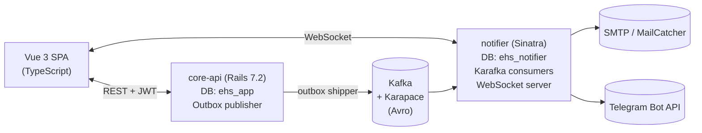

# EHS Incident System

> A portfolio-grade Environment, Health & Safety (EHS) incident management platform built with Ruby on Rails, Vue 3 + TypeScript, and an event-driven Kafka pipeline.

[](https://github.com/stitch80/ehs-incident-system/actions/workflows/ci.yml)
[](LICENSE)


## What this is

A multi-tenant EHS incident reporting and follow-up platform inspired by HSI Donesafe.

- **Workers** report safety incidents from their sites (photos, witnesses, narrative).
- **Investigators** triage, investigate, and assign corrective actions with due dates and evidence.
- **Admins** configure the workspace — users, sites, severity SLAs.

Notifications fan out across **email**, **Telegram**, and **in-app** (WebSocket) channels via a Kafka pipeline with a dedicated notification service.

## Architecture



See [`docs/architecture/02-c4-container.md`](docs/architecture/02-c4-container.md) for the full C4 Container view.

## Try it in 5 minutes

```bash
git clone https://github.com/stitch80/ehs-incident-system.git
cd ehs-incident-system
cp .env.example .env
./scripts/bootstrap.sh
```

This brings up the full stack via Docker Compose, runs migrations, and seeds demo data. After it finishes you can open:

| URL | What |
|---|---|
| http://localhost:5173 | The Vue app |
| http://localhost:1080 | MailCatcher — view confirmation/notification emails sent in dev |
| http://localhost:8080 | Kafka UI — inspect topics & messages |
| http://localhost:8081 | Karapace — Avro schema registry |
| http://localhost:3000/sidekiq | Sidekiq dashboard |
| http://localhost:9001 | MinIO console (`minioadmin` / `minioadmin`) |

Demo accounts (seeded by `scripts/seed-demo.sh`):

| Email | Password | Role |
|---|---|---|
| `admin@acme.demo` | `password` | Admin |
| `investigator@acme.demo` | `password` | Investigator |
| `worker@acme.demo` | `password` | Worker |

Or sign up fresh at `/signup` — signup is enabled by default (toggle with `SIGNUP_ENABLED`).

## Tech stack at a glance

| Layer | Stack |
|---|---|
| **Backend** | Ruby 3.3 · Rails 7.2 (API-only) · Devise + JWT · Pundit · AASM · PaperTrail · Sidekiq · rdkafka-ruby · pg_search |
| **Notification service** | Sinatra · Karafka · Falcon (async) · Sequel · telegram-bot-ruby |
| **Frontend** | Vue 3 · TypeScript · Vite · Pinia · Naive UI · Vue Router · Axios · openapi-typescript |
| **Persistence** | PostgreSQL 16 · Redis 7 · MinIO (S3) |
| **Event bus** | Apache Kafka (KRaft) · Karapace (open-source Schema Registry) · Avro |
| **Security** | TLS · SASL/SCRAM ACLs · encrypted PVCs · AES-256-GCM field-level encryption of PII |
| **Tests** | RSpec · factory_bot · rswag (OpenAPI) · Vitest · Playwright |
| **DevOps** | Docker · Docker Compose · Kubernetes · Kustomize · GitHub Actions |

See each stack section's "Why?" rationale in [`docs/architecture/02-c4-container.md`](docs/architecture/02-c4-container.md).

## Documentation

- [**Architecture**](docs/architecture/) — C4 diagrams (L1–L3), deployment, ADRs
- [**Design**](docs/design/) — domain model, state machines, event contract, security
- [**Flows**](docs/flows/) — sequence diagrams for every critical path
- [**Operations**](docs/operations/) — local dev, K8s deploy, migrations, key rotation, end-to-end verification
- [**User guides**](docs/user-guide/) — Worker / Investigator / Admin

## Repository layout

```
ehs-incident-system/
├── core-api/             # Rails 7.2 API-only monolith
├── notifier/             # Sinatra notification service
├── frontend/             # Vue 3 + TypeScript + Vite
├── shared/envelope/      # ehs-envelope gem (AES-256-GCM)
├── schemas/events/v1/    # Avro schemas (.avsc)
├── docs/                 # Full design + ops + user-guide docs
├── k8s/                  # Kustomize base + local/cloud overlays
├── scripts/              # bootstrap, seed, K8s helpers
└── .github/              # CI/CD workflows, Dependabot, PR & issue templates
```

## Branch & release strategy

- `main` is protected. PRs only. Squash-merge.
- Branches: `feat/<short-name>`, `fix/<short-name>`, `chore/<short-name>`, `docs/<short-name>`.
- Conventional Commits in titles (`feat:`, `fix:`, `chore:`, `docs:`, `refactor:`, `test:`).
- Tag `vMAJOR.MINOR.PATCH` to trigger `release.yml` — builds versioned images and (optionally) deploys.

## Contributing

This is a personal portfolio project. PRs and feedback are welcome — please open an issue first so we can discuss direction.

## Status

MVP under development. See [`CHANGELOG.md`](CHANGELOG.md).

## License

MIT — see [`LICENSE`](LICENSE).
