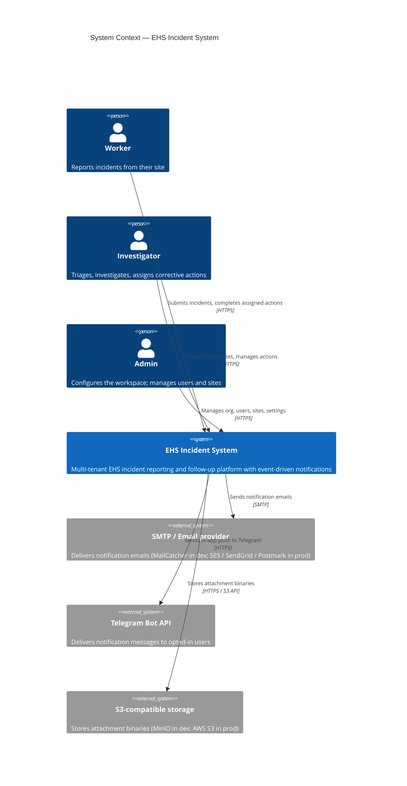

# C4 Level 1 — System Context

The system in its environment: who interacts with it, what external systems it depends on.

## Why this view

A new developer or interviewer should be able to read this single diagram and understand:

1. **The actors.** Three roles, none of them anonymous — even "submit an incident" requires authentication, because every incident must be attributable.
2. **The system boundary.** What's "inside" is one cohesive product; the integrations (Telegram, SMTP, S3) are clearly external.
3. **Why those externals.** Notification fanout is a first-class concern in EHS (incidents must reach people *now*), and attachments — photos, witness statements — quickly outgrow the size that belongs in Postgres.

The L2 (Container) view drills into how the system is decomposed internally.
