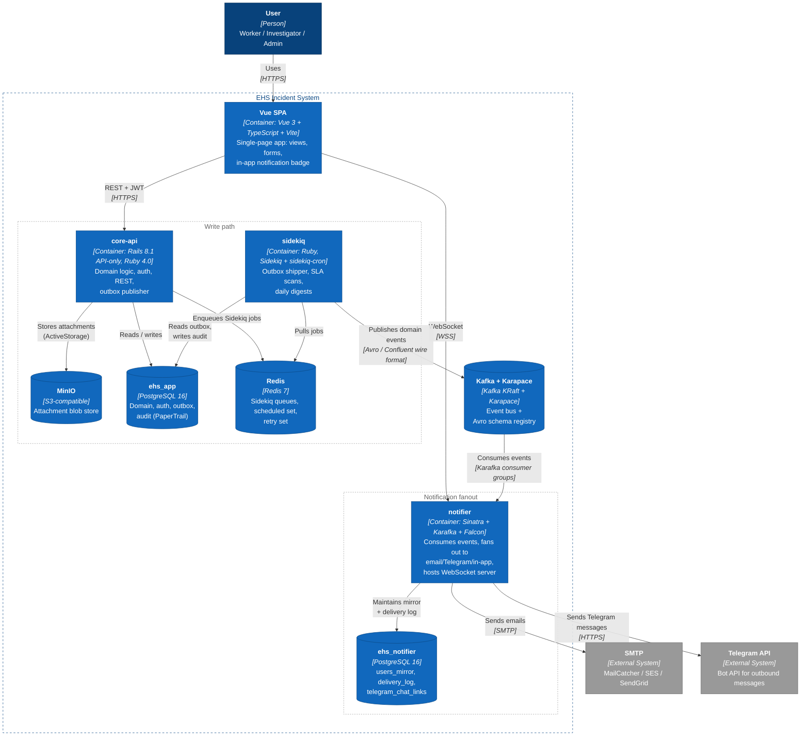

# C4 Level 2 — Containers

How the system is decomposed into deployable units, and how they communicate.

## Why this shape

The deliberate split is:

- **One service that owns the truth** — `core-api`. It does all writes to the canonical store and is the only thing the SPA writes to.
- **One service that owns delivery** — `notifier`. It maintains its own derived state (`users_mirror`, `delivery_log`) so it can run independently of `core-api`'s availability.
- **Kafka as the contract** — schema-versioned, durable, replayable.

We don't go to true microservices (one per aggregate) because the domain isn't large enough to need them — and the cost (more inter-service calls, distributed transactions, more deploy units) outweighs the benefit at this scale.

## Why two databases

| Database | Owner | Why separate |
|---|---|---|
| `ehs_app` | core-api | Source of truth for domain entities |
| `ehs_notifier` | notifier | Derived state (`users_mirror`, `delivery_log`); separating enforces the service boundary at the storage layer — no accidental cross-service joins |

Both live in the same Postgres instance for simplicity; in a larger deploy they'd be separate clusters.

## What's NOT here (yet)

- A dedicated read-replica for analytics
- A separate auth/IdP service (Keycloak / Auth0) — local auth via Devise for now; SSO is documented in [ADR-0008](05-decisions/0008-sso-saml-as-next-step.md)
- A second Kafka consumer for analytics — `incidents.v1` is already designed to support one without changes
