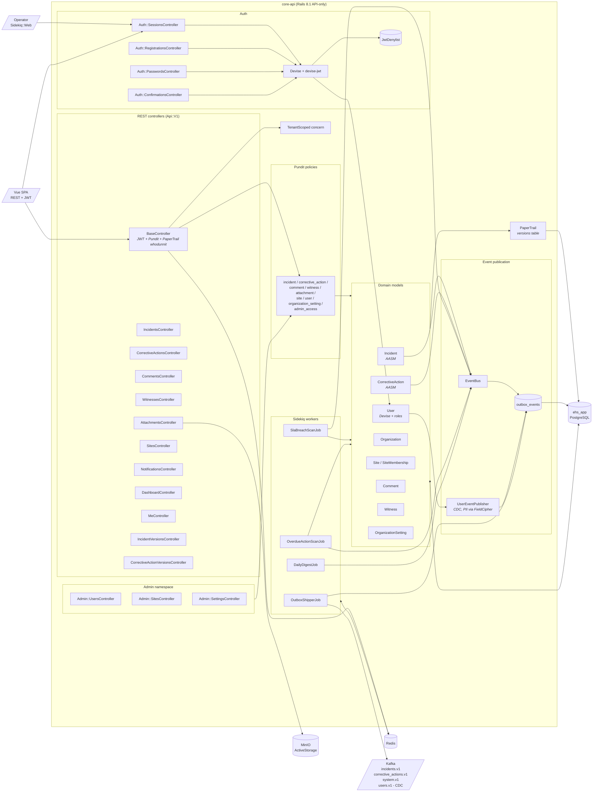
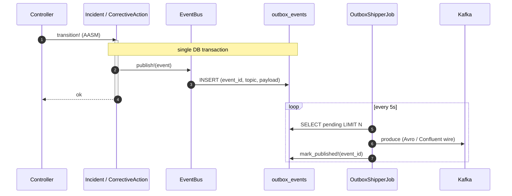

# C4 Level 3 — core-api internals

## Why this shape

- **Layered Rails** — controller → policy → model. `Api::V1::BaseController` is the only place that knows about JWT, Pundit, and PaperTrail's `whodunnit`; the resource controllers stay thin.
- **AASM owns state** — `Incident` and `CorrectiveAction` expose verbs (`submit!`, `triage!`, `complete!`, …); illegal transitions are rejected at the model, not the controller. State change is also the trigger for event emission.
- **One service, one DB, one event log** — no 2PC. Domain writes and `outbox_events` rows commit in the same transaction; a separate shipper job ships them. This is the core reliability primitive of the write path.
- **Pundit + `TenantScoped`** — every policy resolves through `scope_for(user)` on the org tenant. The boundary is enforced in policies, not in controllers or model `default_scope`, so there is exactly one place to look for "can this user see X."
- **Background work lives in [core-api/app/jobs/](../../core-api/app/jobs/)** — sidekiq is its own container ([02-c4-container.md](02-c4-container.md)) but the code is part of core-api: same models, same migrations, same deploy artifact.
- **PaperTrail at the model layer** — every audited model writes a `versions` row on update/destroy with the `whodunnit` set from `Current.user`. `IncidentVersionsController` and `CorrectiveActionVersionsController` expose this as the audit log API.

## Transactional outbox

`event_id` is a ULID generated inside the transaction. The shipper is idempotent on it — duplicate ships are absorbed by consumers' `delivery_log` ([03-c4-component-notifier.md](03-c4-component-notifier.md)). Failures bump `attempt_count` and stash `last_error`; the row stays pending until success.

## Sidekiq workers

| Job | Queue | Schedule | Purpose |
|---|---|---|---|
| `OutboxShipperJob` | `outbox` | `*/5 * * * * *` (every 5 s) | Ships pending `outbox_events` to Kafka |
| `SlaBreachScanJob` | `default` | `0 * * * *` (hourly) | Flags submitted incidents past triage SLA; emits `SlaBreached` |
| `OverdueActionScanJob` | `default` | `0 8 * * *` (daily 08:00) | Flags open/in-progress CAs past `due_date`; emits `CorrectiveActionOverdue`; 24 h de-dupe via `overdue_notified_at` |
| `DailyDigestJob` | `default` | `0 7 * * *` (daily 07:00) | Per-user notification digest |

Schedule lives in [core-api/config/sidekiq.yml](../../core-api/config/sidekiq.yml) and is loaded by [core-api/config/initializers/sidekiq_cron.rb](../../core-api/config/initializers/sidekiq_cron.rb). Queue priorities are `[critical, 3] [default, 2] [outbox, 2] [low, 1]`.

## Auth

JWT issuance and verification live in [core-api/app/controllers/api/v1/auth/sessions_controller.rb](../../core-api/app/controllers/api/v1/auth/sessions_controller.rb) (Devise + devise-jwt). Access tokens are short-lived; refresh is via an httpOnly cookie. Revocation is `JwtDenylist` (Devise's denylist strategy). See [docs/flows/auth-and-jwt-refresh.md](../flows/auth-and-jwt-refresh.md) for the end-to-end refresh sequence.

## Tenant scoping

[core-api/app/models/concerns/tenant_scoped.rb](../../core-api/app/models/concerns/tenant_scoped.rb) provides `for_org(org)` and `scope_for(user)`. Every Pundit policy in [core-api/app/policies/](../../core-api/app/policies/) inherits from `ApplicationPolicy`, whose `Scope#resolve` calls `scope_for(@user)`. Org isolation is therefore enforced once, in the policy layer — not via `default_scope` or controller filters.

## See also

- [03-c4-component-notifier.md](03-c4-component-notifier.md) — what consumes the events on the other side
- [03-c4-component-frontend.md](03-c4-component-frontend.md) — what calls the REST surface
- [02-c4-container.md](02-c4-container.md) — how this fits into the broader topology
