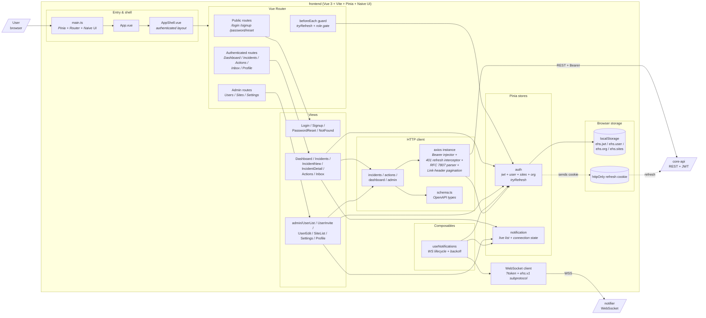
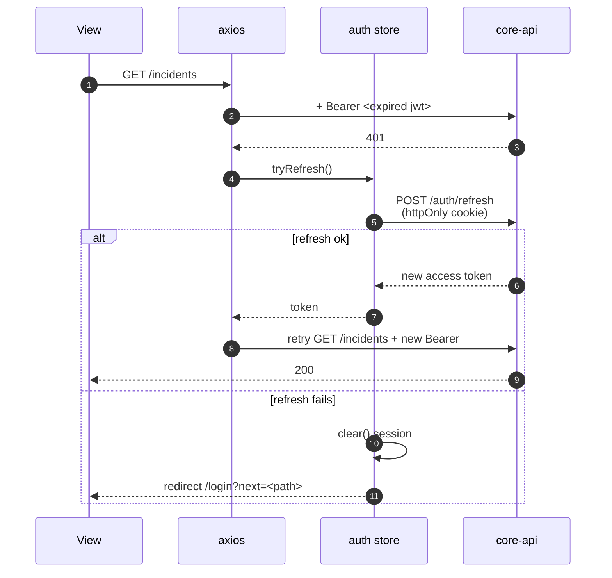
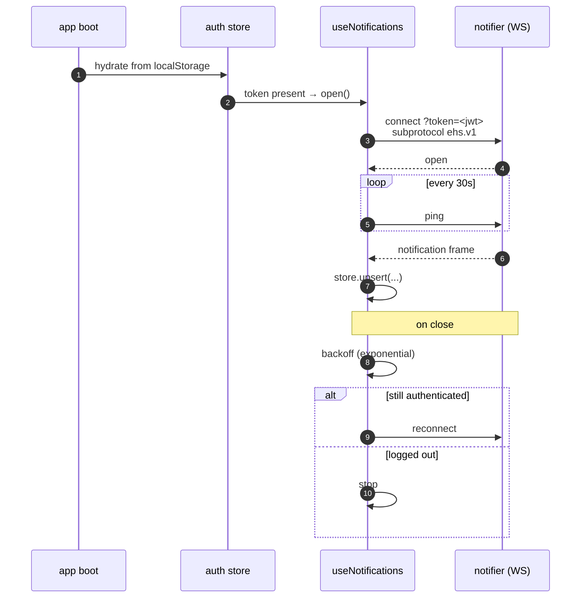

# C4 Level 3 — Vue SPA internals

## Why this shape

- **Pinia stores own session and live state** — `auth` holds the access token, current user, org, and sites; `notification` holds the live in-app list. Everything else (views, composables, axios interceptor) reads from these stores rather than threading props or duplicating state.
- **One axios instance, two interceptors** — request injects `Authorization: Bearer <jwt>`, response handles 401 by routing through `auth.tryRefresh()`. Centralising this means no view ever sees a 401.
- **OpenAPI-generated types** — [frontend/src/api/schema.ts](../../frontend/src/api/schema.ts) is generated from `core-api/openapi.yaml` so the request/response shapes are type-checked against the backend contract at build time.
- **One composable owns the WebSocket** — `useNotifications` is the only thing that opens, pings, reconnects, and closes the WS connection. Views just read from the `notification` store.
- **Naive UI + flat components** — only three custom leaf components ([DurationInput.vue](../../frontend/src/components/DurationInput.vue), [SeverityBar.vue](../../frontend/src/components/SeverityBar.vue), [TrendChart.vue](../../frontend/src/components/TrendChart.vue)). Everything else composes Naive UI primitives directly in views — no premature component hierarchy.
- **Two storage layers** — access token in `localStorage` (so the axios interceptor can read it synchronously); refresh token in an httpOnly cookie (so JS can't touch it). The refresh call sends the cookie with `withCredentials: true` and gets a fresh access token back in the response.

## Auth refresh

Concurrent 401s are coalesced — only one `tryRefresh()` is in flight at a time; queued requests retry once it resolves. Implementation in [frontend/src/api/axios.ts](../../frontend/src/api/axios.ts); store actions in [frontend/src/stores/auth.ts](../../frontend/src/stores/auth.ts). End-to-end version of this flow lives in [docs/flows/auth-and-jwt-refresh.md](../flows/auth-and-jwt-refresh.md).

## WebSocket lifecycle

URL is `VITE_WS_URL` if set, otherwise derived from `window.location` (so prod doesn't need a separate env var). Logout calls `store.clear()` on the notification store so the next login doesn't leak the previous user's notifications. Code: [frontend/src/composables/useNotifications.ts](../../frontend/src/composables/useNotifications.ts).

## Route guards

[frontend/src/router/index.ts](../../frontend/src/router/index.ts) registers a single `beforeEach` that:

1. Calls `auth.tryRefresh()` on any protected route — so a tab left open across token expiry refreshes transparently instead of bouncing to login.
2. Redirects to `/login?next=<path>` if no session can be restored.
3. Checks role from the auth store for `/admin/*` routes; non-admins are redirected to `/`.

## See also

- [03-c4-component-core-api.md](03-c4-component-core-api.md) — the REST surface this client talks to
- [03-c4-component-notifier.md](03-c4-component-notifier.md) — the WS server on the other end
- [02-c4-container.md](02-c4-container.md) — how this fits into the broader topology
