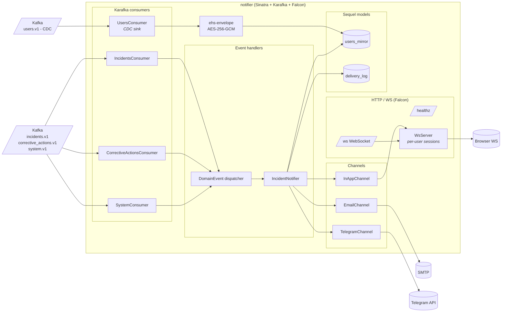
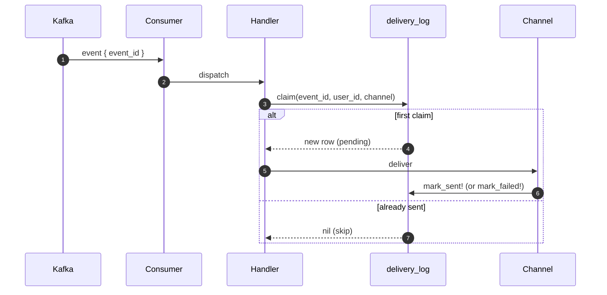

# C4 Level 3 — Notifier internals

## Why this shape

- **One consumer per topic** — Karafka's clean unit of work. Consumers do nothing but Avro-decode and hand off to the dispatcher.
- **Single dispatcher** — `Handlers::DomainEvent` is a tiny event-type → handler map. New event types land as one `register(...)` call plus one handler block.
- **Channels are pure adapters** — they take a `DeliveryLog` row and an enriched recipient (from `users_mirror`) and dispatch through their wire protocol. Add a new channel (Slack, SMS) without touching any handler.
- **`users.v1` CDC keeps `users_mirror` warm** — the rest of the service never calls back to `core-api` for identity, even after restarts. The `ehs-envelope` round trip happens here.
- **Falcon + WsServer** — fiber-based async, cheap multi-thousand WS sessions. `WsServer` keeps an in-process `user_id → Set<connection>` registry so `InAppChannel.deliver` can push without coordination.

## Idempotency model

The unique index on `(event_id, user_id, channel)` means duplicate Kafka deliveries (which happen — Karafka is at-least-once) never produce duplicate emails / Telegrams / in-app pushes.
