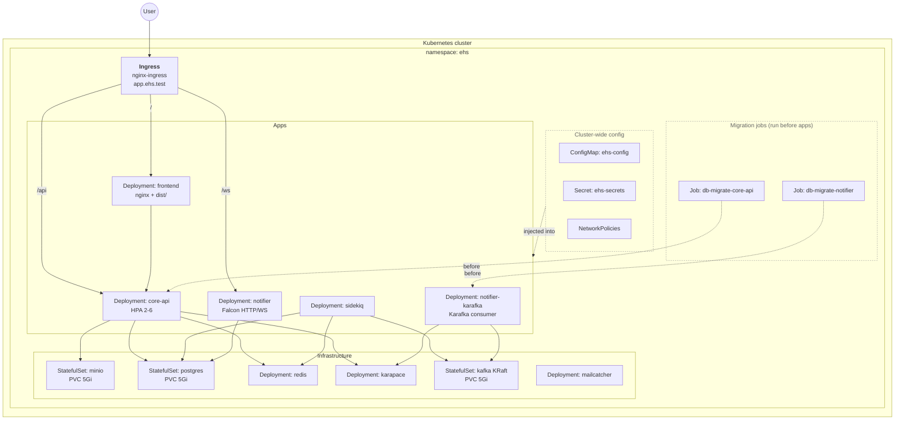

# Deployment topology

## Apply order

The release script (or ArgoCD sync waves) applies in this order:

1. `Namespace`, `ConfigMap`, `Secret`
2. `StatefulSet`s and `Deployment`s for **infrastructure** (Postgres, Redis, Kafka, Karapace, MinIO, MailCatcher) — they have no dependency on the apps
3. `Job/db-migrate-core-api` and `Job/db-migrate-notifier` — block on `condition=Complete`
4. App `Deployment`s — only proceed after migrations are done
5. `Ingress` — exposes once apps are ready
6. `NetworkPolicy` — applied last (or anytime — it's purely additive)

If step 3 fails, step 4 is never executed → old pods keep serving traffic with the previous schema. Even if a new pod somehow boots against an unmigrated DB, the **boot-time tripwire** kills it on startup (see [`docs/operations/migrations.md`](../operations/migrations.md)).

## Overlay differences

| | `local/` overlay | `cloud/` overlay |
|---|---|---|
| Replicas | 1 of everything | 2 of `core-api`, `notifier`, `frontend`; HPA up to 6 |
| Storage class | default (Docker Desktop / kind hostPath) | encrypted PVC class |
| Ingress | NodePort or `/etc/hosts` to `app.ehs.test` | LoadBalancer + cert-manager Let's Encrypt |
| Secrets | committed dev values | External Secrets Operator or out-of-band `kubectl create` |
| Kafka security | PLAINTEXT (single-node) | TLS + SASL/SCRAM + ACLs |
