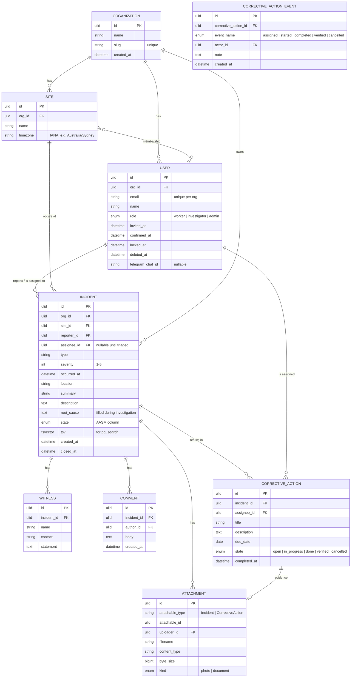

# Domain model

## Key constraints

- **Tenant scoping** — every row except `Organization` and `User` (which references org) has `org_id`; enforced by `default_scope` on each AR model + Pundit `Scope` classes.
- **ULIDs as primary keys** — sortable by creation time, URL-safe, no collisions across services. Future-proofs sharding.
- **Soft delete on `User`** — sets `deleted_at`, JWTs revoked via denylist, audit history preserved (PaperTrail).
- **Polymorphic `Attachment`** — same table backs both incident photos and corrective-action evidence.

## What the AASM `state` column drives

| Model | States |
|---|---|
| `Incident` | `draft → submitted → investigating → pending_closure → closed` (plus reopen) |
| `CorrectiveAction` | `open → in_progress → done → verified` |

Full diagrams: [state-machines.md](state-machines.md).

## PaperTrail audit and domain event logs

Versions are written for every change on `Incident` and `CorrectiveAction`.
This is critical for the EHS narrative — incident records must be defensible in
regulatory reviews, which means "who changed what when" is non-negotiable.

`corrective_action_events` is a separate append-only **domain audit log**
distinct from PaperTrail's `versions` table. It captures *who made which state
transition with what note*, while `versions` captures *what attribute diffs
were applied*. Both serve compliance, but the SPA's Activity feed reads from
`corrective_action_events`, which gives it operator-level semantics (started,
completed, verified, etc.) without unpacking attribute diffs.

## Search

`incidents.tsv` is a `tsvector` populated by `pg_search` from `summary +
description + root_cause`. A GIN index on it makes full-text search fast without
dragging in Elasticsearch.
