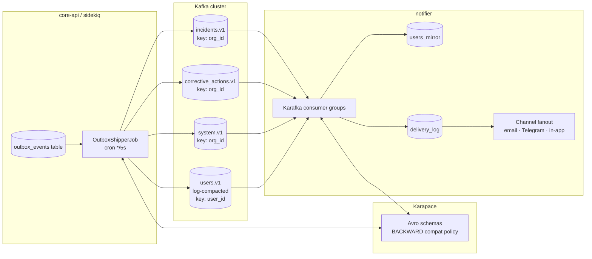

# Event contract

## Topology

## Topics

| Topic | Key | Compaction | Schemas |
|---|---|---|---|
| `incidents.v1` | `org_id` | log (default) | `IncidentSubmitted`, `IncidentAssigned`, `IncidentClosed` |
| `corrective_actions.v1` | `org_id` | log | `CorrectiveActionAssigned`, `CorrectiveActionStarted`, `CorrectiveActionCompleted`, `CorrectiveActionVerified`, `CorrectiveActionCancelled`, `CorrectiveActionOverdue` |
| `users.v1` | `user_id` | **compact** | `UserUpserted` |
| `system.v1` | `org_id` | log | `SlaBreached` |

All corrective-action events share an optional `note: ["null", "string"]`
field on their subject record, carrying the operator-supplied context for that
transition. The notifier interpolates it into the email + in-app body when
present. The schema's `null` default keeps replayed events backward-compatible
when the field was added.

The `incidents.v1` topic is keyed by `org_id` so per-tenant event order is
preserved (a single partition for a tenant means all its events arrive in the
order they were published).

`users.v1` is **log-compacted** — Kafka retains only the latest value per
`user_id`, so a brand-new notifier deployment can rebuild `users_mirror` from
scratch by replaying the topic from offset 0.

## Wire format

Confluent wire format: `0x00 || <4-byte big-endian schema_id> || <Avro binary>`.

Schema IDs are assigned by Karapace at registration. Producer's `avro-turf`
embeds them; consumer's `avro-turf` resolves them from Karapace and caches them
in-process.

## Compatibility policy

Set at registry level: **`BACKWARD`** — new schema versions must be able to read
old payloads. Concretely:

- Adding a field with a default → ✅ allowed
- Removing a field that had a default → ✅ allowed
- Renaming a field → ❌ rejected (use Avro aliases instead)
- Narrowing a type (`long` → `int`) → ❌ rejected
- Widening a type (`int` → `long`) → ✅ allowed

Karapace rejects incompatible publishes at registration time, so a CI run that
includes a bad schema change fails before the producer code ever runs.

## Outbox pattern

Domain events are written to `outbox_events` *in the same DB transaction* as
the state change that caused them. A Sidekiq cron job (`OutboxShipperJob`)
runs every 5 seconds, reads unpublished rows, publishes to Kafka, marks them
published. Idempotent on `event_id`.

This gives us **at-least-once delivery without distributed transactions**:

- If the DB commits but Kafka publish fails → row stays unpublished, retried next tick
- If the producer crashes mid-publish → next tick re-publishes; consumer idempotency (via `delivery_log` unique key) absorbs the duplicate

## PII discipline

Domain topics (`incidents.v1`, `corrective_actions.v1`, `system.v1`) carry **only operational fields and `recipient_user_ids`** — never `email`, `phone`, or `telegram_chat_id`.

`users.v1` is the exception — but its PII fields are **encrypted at the field level** with `ehs-envelope` (AES-256-GCM). See [security.md](security.md).
