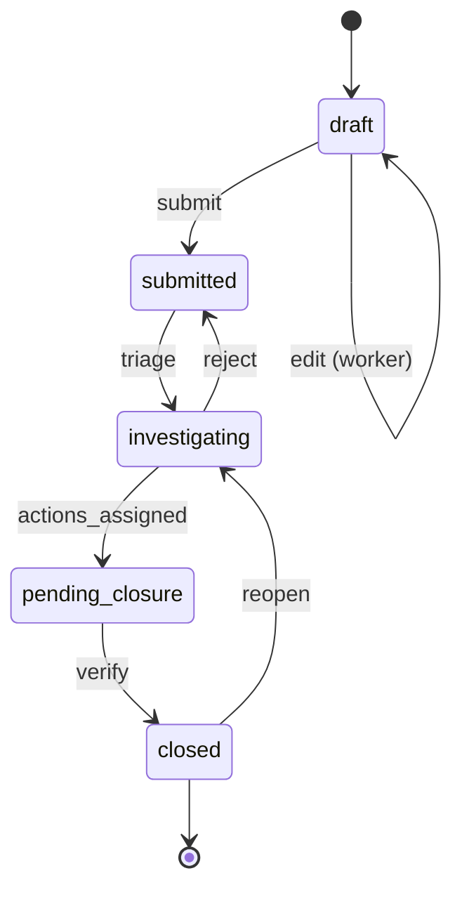
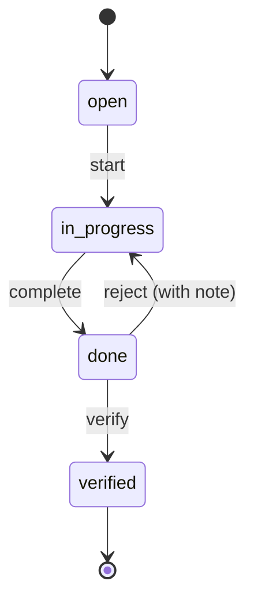

# State machines

Both critical aggregates use [AASM](https://github.com/aasm/aasm) to enforce
valid transitions, hang notifications/audit on `after_transition` callbacks,
and surface a clean `transition!` API to the controller.

## Incident

### Guards & callbacks

| Transition | Guard | After-transition side-effect |
|---|---|---|
| `submit` | reporter is worker on the site; required fields filled | enqueue `OutboxEvent` → `IncidentSubmitted` |
| `triage` | actor is investigator/admin; assignee specified; severity set | enqueue `OutboxEvent` → `IncidentAssigned` |
| `actions_assigned` | at least one corrective action exists | (no event — implicit) |
| `verify` | all corrective actions are `verified` | enqueue `OutboxEvent` → `IncidentClosed` |
| `reopen` | actor is investigator/admin; new note required | reset `closed_at`; PaperTrail captures reason |

## Corrective Action

### Activity feed and notes

Every transition — including the implicit `assigned` at creation — writes a
row to `corrective_action_events` capturing the actor, the timestamp, and an
operator-supplied optional note. The same AASM `after` callback that writes
the audit row also emits the corresponding outbox event
(`CorrectiveActionAssigned`, `CorrectiveActionStarted`,
`CorrectiveActionCompleted`, `CorrectiveActionVerified`,
`CorrectiveActionCancelled`). The note travels in the Avro subject so the
notifier can interpolate it directly into email + in-app bodies without
re-querying the audit log. The SPA reads the audit table via
`GET /corrective_actions/:id/events` to render a chronological Activity
timeline.

### SLA-driven defaults

Due dates default from incident severity (overridable):

| Severity | Default due (days) |
|---|---|
| 1 (catastrophic), 2 | 7 |
| 3 | 14 |
| 4, 5 | 30 |

The nightly `OverdueActionScanJob` emits `CorrectiveActionOverdue` events for any action whose `due_date` passed without entering `done`.
