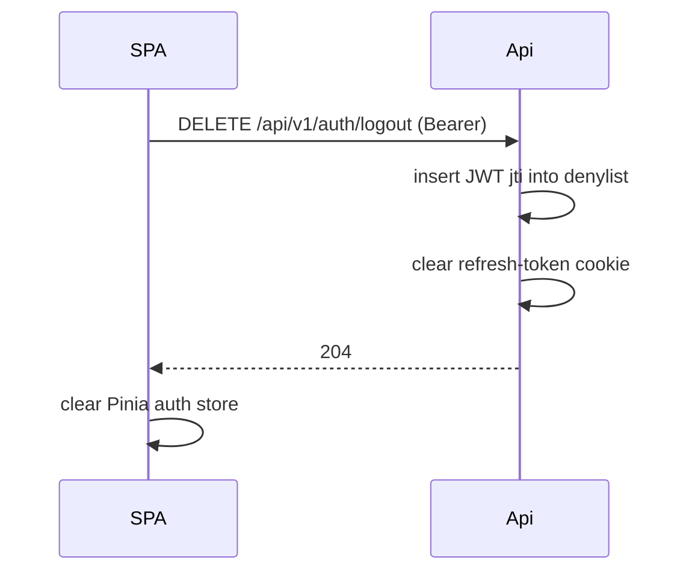

# Flow — Auth and JWT refresh

```mermaid
sequenceDiagram
    autonumber
    participant SPA as Vue SPA (axios)
    participant Api as core-api

    Note over SPA,Api: Initial login
    SPA->>Api: POST /api/v1/auth/login {email, password}
    Api-->>SPA: 200 + Authorization: Bearer <access><br/>Set-Cookie: refresh_token=<...>; HttpOnly; Secure

    Note over SPA: store access in Pinia (memory only — NOT localStorage)

    SPA->>Api: GET /api/v1/incidents (Bearer access)
    Api-->>SPA: 200 data

    Note over SPA,Api: ~15 minutes pass — access token expires
    SPA->>Api: GET /api/v1/incidents (Bearer access)
    Api-->>SPA: 401

    SPA->>Api: POST /api/v1/auth/refresh<br/>(cookie sent automatically)
    Api-->>SPA: 200 + Authorization: Bearer <new access>

    SPA->>Api: GET /api/v1/incidents (Bearer new access) — auto-retry
    Api-->>SPA: 200 data
```

## Axios interceptor (single-flight refresh)

The axios response interceptor catches 401 once per request, kicks off a single
shared `tryRefresh()` promise (so concurrent requests share one refresh), then
retries the original request. Implementation: [`frontend/src/api/axios.ts`](../../frontend/src/api/axios.ts).

## Logout



The denylist check happens on every request (cheap — indexed). Any further use
of the revoked access token returns 401, and the refresh cookie is gone too, so
the SPA falls back to the login page.
