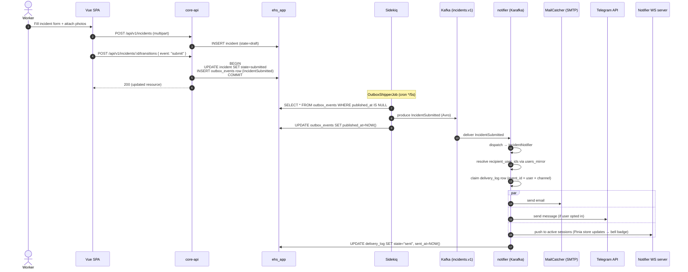

# Flow — Incident submission

A worker submits a new incident. The state transition emits an event via the
outbox, which is shipped to Kafka and consumed by the notifier, which fans out
to email, Telegram, and in-app channels.

## What can fail and how it recovers

| Failure point | Recovery |
|---|---|
| DB commits but app crashes before Sidekiq triggers | OutboxShipper runs every 5s — next tick picks up the row |
| Kafka produce fails | Outbox row stays `published_at: null` — retried next tick |
| Notifier consumer crashes mid-message | Karafka does not commit offset — re-delivered on restart; `delivery_log` unique index deduplicates |
| Email send fails (SMTP error) | `delivery_log.state = "failed"`, error captured; Karafka retries per its retry/DLQ config |
| Telegram unreachable | Same as email |
| All WS sessions disconnected | In-app notification is persisted to `delivery_log`; next WS connect replays last 20 unread |
