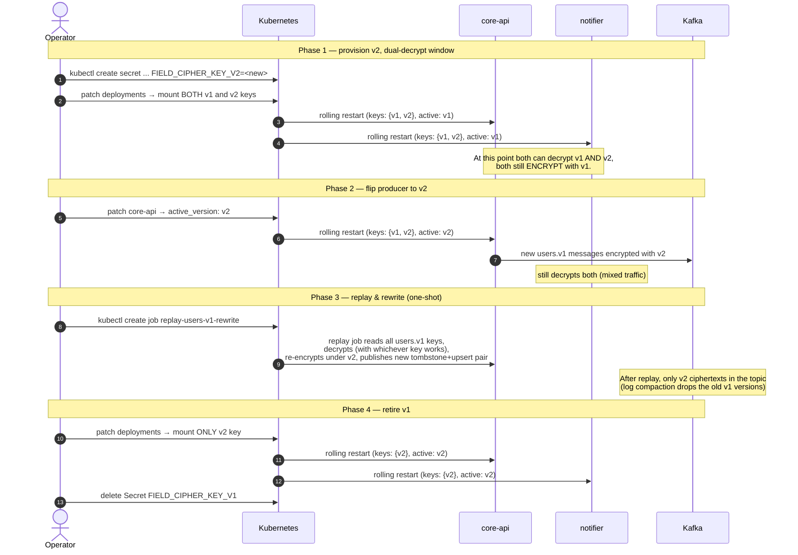

# Flow — Field-cipher key rotation

Last rehearsed: 2026-05-18 (see "Verified rehearsal" section below).

Rotating the `FIELD_CIPHER_KEY` without downtime or data loss, across both
`core-api` (producer) and `notifier` (consumer).



## Pre-flight checklist

- [ ] Generate new key: `openssl rand -base64 32`
- [ ] Store it in the secrets backend (External Secrets / sealed-secrets / etc.)
- [ ] Verify all running pods can read both keys (`kubectl exec ... env | grep FIELD_CIPHER`)
- [ ] Have the replay job tested in staging first

## Rollback at any phase

| Phase reached | Rollback step |
|---|---|
| After Phase 1 | Remove v2 key from deployments; redeploy. Nothing was written with v2 yet — no data loss. |
| After Phase 2 | Flip producer back to `active_version: v1`. Mixed-encryption stays until next replay; consumer still decrypts both. |
| After Phase 3 | Once replayed, every message is v2-encrypted. Rollback requires re-replaying with the old key — make sure you keep v1 mounted until you're confident. |
| After Phase 4 | v1 is gone. No rollback. Treat this as a permanent step. |

## Why this approach

- **No coordinated stop** — apps roll restart, consumers don't see gaps
- **No "encrypted with unknown key" errors** — every running pod has every key it might encounter
- **Audited** — every step is a `kubectl` operation, captured by Kubernetes' own audit log

## Verified rehearsal (2026-05-18)

Run the drill with:

```bash
bash scripts/key-rotation-drill.sh
```

The script generates fresh v1 and v2 keys, exercises all four phases against the
`shared/envelope` gem directly (no running stack required), and exits non-zero if any
phase fails. Output from the 2026-05-18 run:

```
=== Key-rotation drill ===
Ruby: ruby 3.4.5 (2025-07-16 revision 20cda200d3) +PRISM [arm64-darwin24]
Envelope lib: .../shared/envelope/lib

Generated v1 key (first 8 chars): 6tqVnRP4...
Generated v2 key (first 8 chars): nFfWEKMR...

--- Phase 1: encrypt with v1 only (pre-rotation baseline) ---
  v1 ciphertext prefix : v1:pEE2plNrs96GAys9:5Aq8IXRaXu8vENpYcNR+o...
  round-trip decrypt   : rotation-test-pii
  PASS

--- Phase 2: dual-keyring, flip producer to v2 ---
  v2 ciphertext prefix : v2:yjOWG5kCBDrJqRDi:kRBiHO1LVbaAMJYrmXopN...
  decrypt v2 ciphertext: new-pii-under-v2
  PASS

--- Phase 3: dual-keyring decrypts legacy v1 ciphertext ---
  decrypted old v1 ct  : rotation-test-pii
  PASS

--- Phase 4: retire v1 - v1 ciphertext must now FAIL ---
  Got expected error: Ehs::Envelope::UnknownKeyVersion (v1)
  PASS

=== All phases passed ===
```

### Gotchas discovered during drill

- **Ruby 3.4 removed `base64` from default gems.** The gemspec now declares
  `spec.add_dependency "base64"` so both the gem and specs load cleanly on Ruby
  3.4+. No API changes required.
- The `ehs-envelope` gem already supported dual-decrypt from the start: the
  `keys:` hash and `active_version:` initializer arguments handle the entire
  rotation flow without any new methods. No gem API additions were needed.
- The drill script runs fully offline (no Docker, no Kafka, no running services),
  making it safe to run alongside live stack work.
