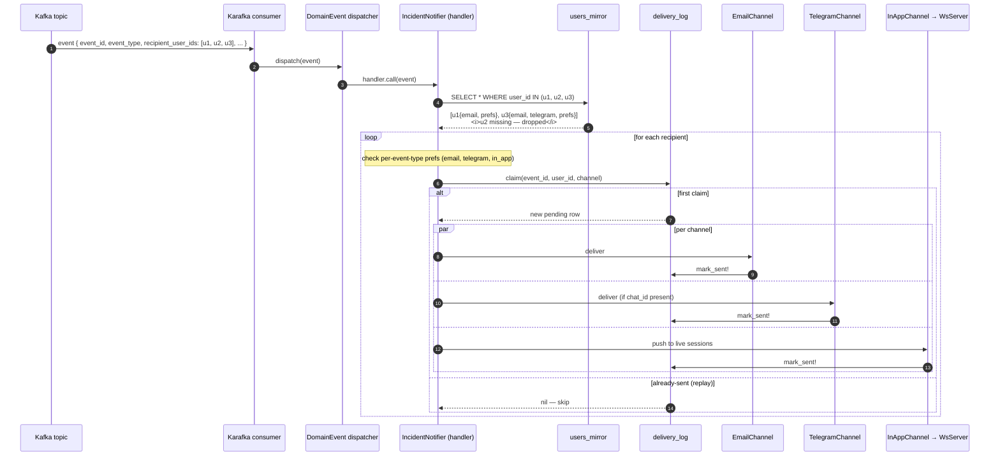

# Flow — Notification fanout

How a single domain event becomes notifications across multiple channels for
multiple recipients, idempotently.

## Key invariants

- **One row per `(event_id, user_id, channel)`** in `delivery_log` — unique index. Even if Karafka re-delivers, fanout is idempotent.
- **Failed deliveries get a state of `failed`** and the error message. Karafka's retry/DLQ takes over from there.
- **Missing recipients in the mirror are silently dropped** — this is the right behavior: a missing user typically means a soft-deleted account. The CDC ensures the mirror catches up eventually.
- **Per-channel preference check** is `prefs[event_type][channel] || defaults[channel]`. Defaults: email=on, telegram=off (opt-in), in-app=on.
