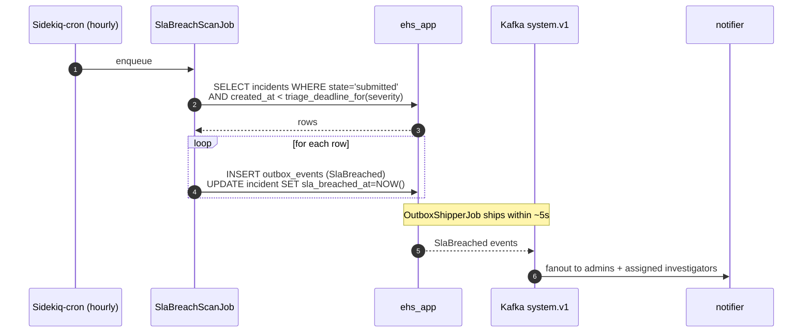

# Flow — SLA breach detection

The triage SLA is severity-driven. A nightly scan detects incidents that missed
their triage window and emits `SlaBreached` events.

## Triage windows

| Severity | Triage window |
|---|---|
| 1 (catastrophic), 2 | 4 hours |
| 3 | 24 hours |
| 4, 5 | 72 hours |

Configurable per-org in `admin/settings`.

## Why this matters for the narrative

EHS platforms exist to move organizations "from reactive to proactive safety"
(HSI Donesafe's own phrasing). A measurable, automated breach scan with audited
delivery is exactly the kind of "proactive" capability interviewers look for.
