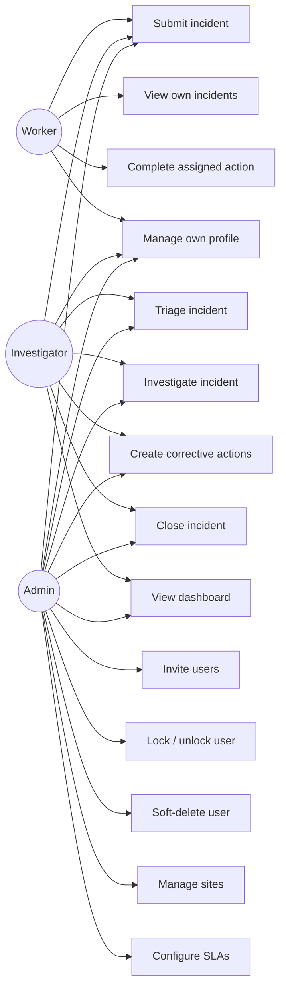

# Use cases

## Detail

| ID | Use case | Trigger | Outcome | Acceptance |
|---|---|---|---|---|
| UC1 | Submit incident | Worker observes a safety event | Incident enters `submitted` state; assigned investigator notified | Form validates required fields; photo upload < 25MB; submission produces an `IncidentSubmitted` event |
| UC2 | View own incidents | Worker checks status | Worker sees only incidents they reported | Pundit `Scope` filters; no IDs from another worker are reachable by URL |
| UC3 | Complete assigned action | Assignee | Action moves to `done`; investigator receives a notification that includes the assignee's optional completion note | Optional evidence upload; due-date awareness; the note is appended to the action's append-only activity feed |
| UC4 | Manage own profile | Any user | Profile updated; Telegram chat linked if requested | Email change re-confirms; password change requires current password |
| UC5 | Triage incident | Investigator picks from triage queue | State → `investigating`; severity & assignee set | Triage SLA timer satisfied; `IncidentAssigned` event emitted |
| UC6 | Investigate | Investigator | Root cause captured; comments visible to other investigators | Audit history (PaperTrail) records every change |
| UC7 | Create corrective actions | Investigator | One or more actions assigned to owners with due dates; optional assignment note becomes the first entry in the activity feed | Default due date computed from severity SLA |
| UC8 | Close incident | Investigator | State → `closed` once all actions are `verified` | Cannot bypass — guard enforces |
| UC9 | View dashboard | Investigator / admin | KPIs visible: open by severity, overdue, trend last 30 days | Single read of `dashboard#show` |
| UC10 | Invite user | Admin | New user created in `invited` state; email sent | `devise_invitable` token; expires in 3 days |
| UC11 | Lock / unlock user | Admin or auto (5 failed logins) | User cannot log in until unlocked | Devise `lockable` |
| UC12 | Soft-delete user | Admin | User access revoked; audit history preserved | Sets `deleted_at`; JWTs revoked via denylist |
| UC13 | Manage sites | Admin | Sites created/edited; users assigned | Sites have timezones for SLA math |
| UC14 | Configure SLAs | Admin | Per-org override of severity → triage / action defaults | Defaults shipped; org may shorten them |
